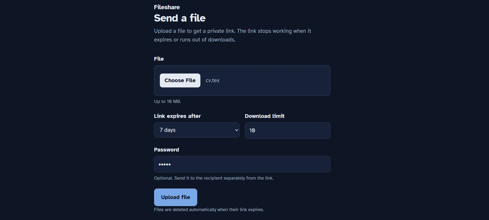
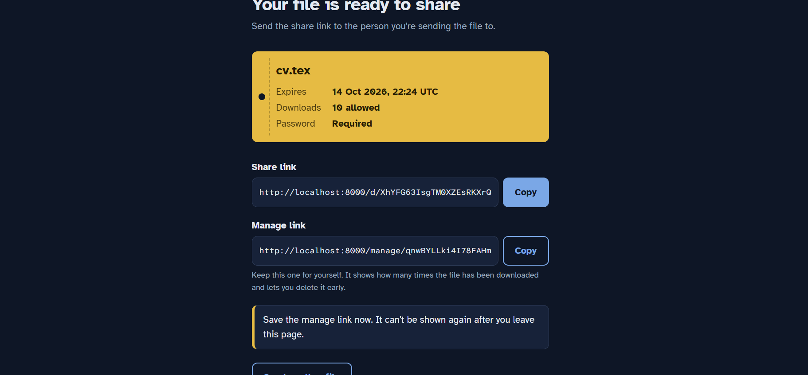
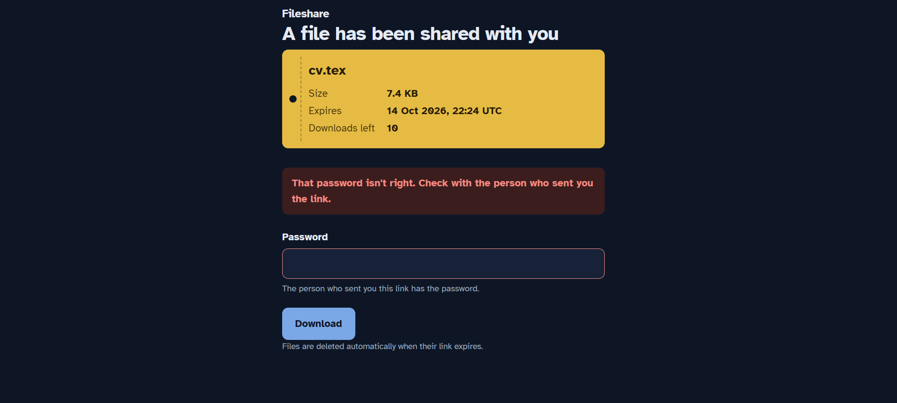
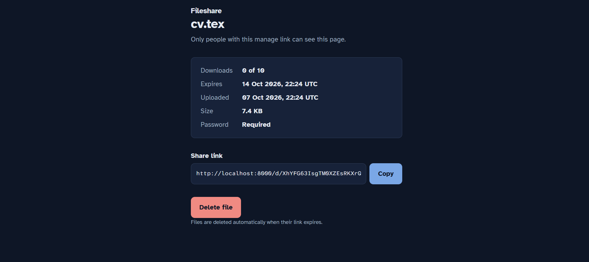
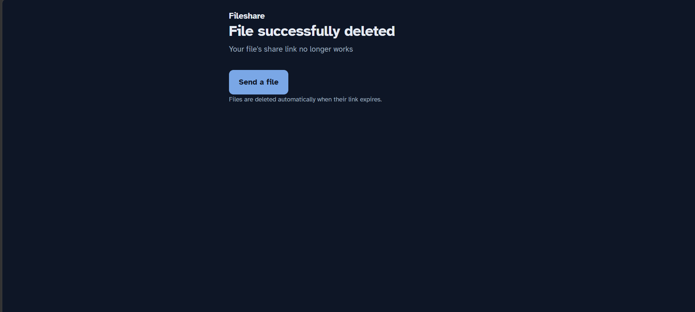

# File Sharing App

A webapp that focuses on allowing users to securely send files to others with an optional password and download limit, via links that can be sent to the recipient, after having uploaded the file temporarily to the site.
The uploader can view how many downloads the file has, and can also delete it any time.#

## How to use

User can upload file with an optional password, optional download limit, and a chosen expiry timer.\

Uploader receieves link to share to recipients, and a link to themselves to manage the uploaded file.\

Recipient can downlad file from this page, and the file does not download if password guess is incorrect.\

Uploader can see details of file and delete it at any time.\

Error page that can signify deleted/non-existent files, expired files, etc.\
